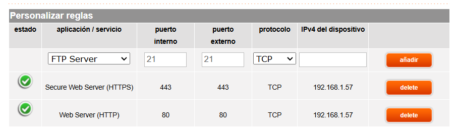
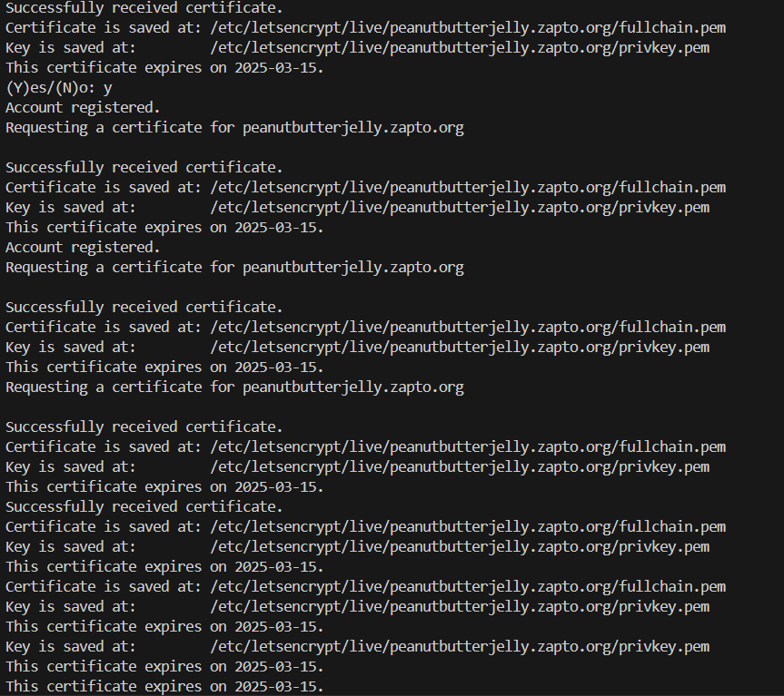

# Self-Hosting Server Setup

This repository contains the resources and documentation for a project focused on setting up and managing a self-hosted web server at home.

## Objectives

The main goal of this project is to develop skills in:

- Hosting a web server on a personal network.
- Configuring domains, DNS, and router settings.
- Setting up secure connections (HTTPS).
- Automating deployments with tools like Docker, Vagrant, or Ansible.
- Conducting server performance testing.

## Features

1. **Domain and DynDNS Configuration**

   - Register a custom domain.
   - Link the domain to a dynamic IP using dynamic DNS services.

2. **Router Port Forwarding**

   - Forward HTTP (80) and HTTPS (443) ports to the server.
     

3. **Web Server Setup**

   - Use Nginx for server deployment.
   - Configure custom error pages (e.g., 404 errors).
   - Set up basic authentication for admin and status routes.

4. **Performance Testing**

   - Evaluate server performance under different loads with Apache Benchmark (ab).

5. **Secure Connections**

   - Implement SSL/TLS using self-signed certificates or services like Let’s Encrypt.
     

6. **Automated Deployment**
   - Deploy using Vagrant.

## Tools and Technologies

- **Web Server:** Nginx
- **SSL/TLS:** Let’s Encrypt
- **Performance Testing:** Apache Benchmark
- **Automation:** Vagrant
- **Monitoring:** Netdata
